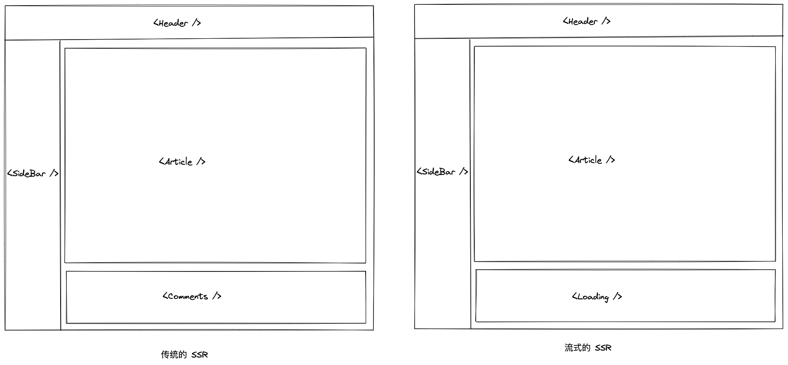
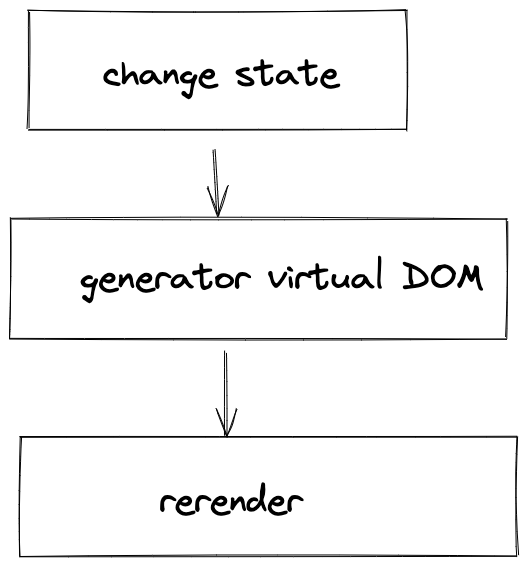
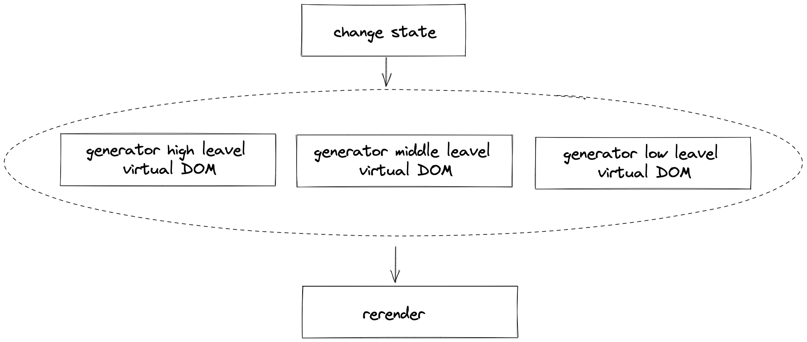
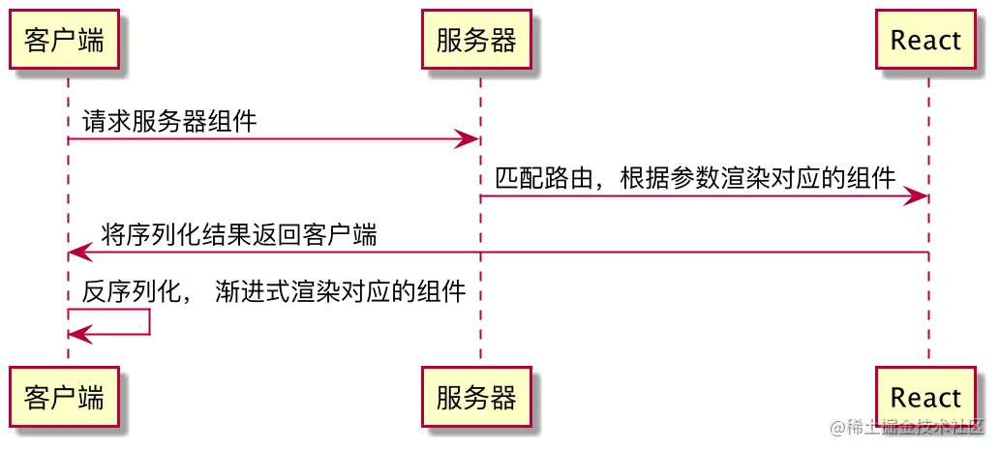

# React18

## 变更

### IE 兼容性问题

react@18 不再支持 IE11，需要兼容 IE 的请使用 react@17

### createRoot

react-dom@18 提供了 2 个根 API，一个是老的 ReactDOM.render(), 一个是新的 ReactDOM.createRoot()。

> react-dom.development.js:86 Warning: ReactDOM.render is no longer supported in React 18. Use createRoot instead. Until you switch to the new API, your app will behave as if it's running React 17. Learn more: https://reactjs.org/link/switch-to-createroot

``` jsx
// 老的写法
import React from 'react';
import ReactDOM from 'react-dom';
import App from './App';

ReactDOM.render(<App />, document.getElementById('root'));
```

``` jsx
// 新的写法
import React from 'react';
import ReactDOM from 'react-dom/client';
import App from './App';

const root = ReactDOM.createRoot(document.getElementById('root'));
root.render(
  <React.StrictMode>
    <App />
  </React.StrictMode>
);
```

### StrictMode

v16.3 就已经添加的新特性，如果作为包裹 UI 组件来用的话 `StrictMode = Fragment`，但 `StrictMode` 设计初衷并不是用来替代 `Fragment` 的，它的目的是用来检查开发模式下突出显示应用中潜在的问题。可以简单理解为 React 团队为后续版本 API 做了调整留了一个报警的口子。
比如：  
* 识别不安全的生命周期
* 使用过时 ref API
* 关于使用废弃的 findDOMNode 方法的警告

更多见： https://zh-hans.reactjs.org/docs/strict-mode.html
### setState

这个算是 React18 中最大的破坏性更新。

**React 自动批处理** 简单来说就是将多个状态的更新合并为一次重新渲染，以达到更新性能的目的。

v18 之前：只能在生命周期和合成事件函数中进行批处理，默认情况下 Promise、setTimeout以及原生事件中不会进行批处理

``` jsx
  const onClick = () => {
    Promise.resolve().then(() => {
      setCount(count++)
    })
    setFlag(!flag)
  }
  // render 会渲染 2 次
```

v18 之后：会对所有的更新进行批处理操作，上面的代码只会执行 1 次 render。  
那如果我想在 React18 中退出批处理应该怎么做呢？官方提供了一个新的 API flushSync

### flushSync

``` jsx
import { flushSync } from 'react-dom';

function handleClick() {
  flushSync(() => {
    setCount(c => c + 1);
  });
  // React 更新一次 DOM
  flushSync(() => {
    setFlag(f => !f);
  });
  // React 更新一次 DOM
}

```

React18 的自动批处理在大多数场景下对之前的代码是没有影响的，只是在 Class 组件中，如果你在两次 setState 中间去读取 state 的值的时候会出现不兼容的情况。

``` jsx
onClick = () => {
  setTimeout(() => {
    this.setState(({ count }) => ({ count: count + 1 }));
    // 在 React17 及之前，打印出来是 { count: 1, flag: false }
    // 在 React18，打印出来是 { count: 0, flag: false }
    console.log('----this.state----', this.state);

    this.setState(({ flag }) => ({ flag: !flag }));
  }, 0);
};
```
当然想要 React18 也能和之前的效果一样的话也是可以的，通过 flushSync 来解决

``` jsx
onClick = () => {
  setTimeout(() => {
    ReactDOM.flushSync(() => {
      this.setState(({ count }) => ({count: count + 1}))
    })
    // 打印 {count: 1, flag: false}
    console.log('----this.state----', this.state)
  }, 0);
}
```

### 已卸载的组件更新状态警告

在 React17 版本如下代码

``` jsx
async function handleSubmit() {
  setPending(true)
  await post('/someapi') // component might unmount while we're waiting
  setPending(false)
}
```
假如我们在请求过程中卸载了组件，就会报如下错误


在 React18 中已经删除了这个警告，为什么删掉呢？后面解释

### 组件返回 undefined

在 React18 之前, 这样写

``` jsx
const Demo = () => {
  return undefined
}
```
会抛出如下错误：


但是在 React18 中不会有这个问题了，它把这个错误提醒给删除了。

为什么要删除这个提醒呢？  
主要原因：
* React18 Suspense fallback 会出现 undefined 的情况，为了保证 fallback 为 undefined 而不报错，故删除了这个警告。
* TS 类型系统和 ESLint 已经比较健壮了，这类错误可以在写代码的时候就会有提醒，完全可以避免掉这类问题。

### Children

children 属性从 React.FunctionComponent (即 React.FC) 中移除了，需要显示定义

18 之前

``` tsx
import * as React from 'react';

type Props = {};

const Component: React.FC<Props> = ({children}) => {...}

```

18 之后

``` tsx
type Props = {
  children?: React.ReactNode
};
const Component: React.FC<Props> = ({children}) => {...}
```

18 之后必须对 children 进行定义

**为什么要移除这个呢？**

看下面的例子：

``` tsx
const ComponentWithNoChildren: React.FC = () => <>Hello</>;

<ComponentWithNoChildren>
   // 传入了多余的 children，实际上父组件并没有 children, 但是在 18 之前也不会报错
   <UnusedChildrenSinceComponentHasNoChildren />
</ComponentWithNoChildren>

```

更多参见：https://solverfox.dev/writing/no-implicit-children/

### 服务器流式渲染

SSR 页面一次渲染的大致流程为：
1. 服务端 fetch 页面所有的数据
2. 数据准备好之后，将组件渲染成 string 的形式作为 response 返回
3. 客户端加载资源
4. 客户端合成(hydrate)最终的页面内容

在传统的 SSR 模式中，上述流程是串行执行的，如果其中有一步比较慢的话都会影响到整体的渲染速度。

而在 React18 中，基于全新的 Suspense, 支持了流式的 SSR，也就是允许服务端一点一点的返回页面。

* React17:

``` tsx
<Layout>
  <Header />
  <Sidebar />
  <RightPane>
    <Article />
    <Comments />
  </RightPane>
</Layout>
```

渲染后为

``` html
<main>
  <header>
    <!--Header -->
    <a href="/">Home</a>
   </header>
  <aside>
    <!-- Sidebar -->
    <a href="/profile">Profile</a>
  </aside>
  <article>
    <!-- Article -->
    <p>Hello world</p>
  </article>
  <section>
    <!-- Comments -->
    <p>First comment</p>
    <p>Second comment</p>
  </section>
</main>
```

* React18:

通过 <Suspense> 包裹 <Comments> 组件，使之成为流式渲染

``` tsx
const Comments = React.lazy(() => import('./Comments'))

// render
<Layout>
  <Header />
  <Sidebar />
  <RightPane>
    <Article />
      <Suspense feedback={<Loading />}>
        <Comments />
      </Suspense>
  </RightPane>
</Layout>
```

在 Comments 组件还没渲染好时吐给前端的代码为

``` html
<main>
  <header>
    <!--Header -->
    <a href="/">Home</a>
   </header>
  <aside>
    <!-- Sidebar -->
    <a href="/profile">Profile</a>
  </aside>
  <article>
    <!-- Article -->
    <p>Hello world</p>
  </article>
  <section>
    <!-- Loading -->
    
  </section>
</main>
```
当 <Comments> 组件准备好之后，React 会通过同一个流（stream）发送给浏览器（res.send 替换为 res.socket），并替换为相应的位置。


## 提供给第三方库用的 API

### useSyncExternalStore

**语法**

``` jsx

const state = useSyncExternalStore(subscribe, getSnapshot[, getServerSnapshot]);

```

**应用场景**

useSyncExternalStore 能够让 React 组件在 Concurrent Mode 下安全地有效地读取外接数据源。

示例代码：

``` tsx
import { useMemo, useSyncExternalStore } from 'react';

function useInnerWidth(): number {
  // 保持 subscribe 固定引用，避免 resize 监听器重复执行
  const [subscribe, getSnapshot] = useMemo(() => {
    return [
      (notify: () => void) => {
        // 真实情况这里会用到节流
        window.addEventListener('resize', notify);
        return () => {
          window.removeEventListener('resize', notify);
        };
      },
      // 返回 resize 后需要的快照
      () => window.innerWidth,
    ];
  }, []);
  return useSyncExternalStore(subscribe, getSnapshot);
}
```

``` tsx
function WindowInnerWidthExample() {
  const width = useInnerWidth();

  return <p>宽度: {width}</p>;
}
```

在 Concurrent Mode 下，React 一次渲染会分片执行（以 fiber 为单位），中间可能穿插优先级更高的更新。假如在高优先级的更新中改变了公共数据（比如 redux 中的数据），那之前低优先的渲染必须要重新开始执行，否则就会出现前后状态不一致的情况。

主要是给一些框架使用的，日常业务应该使用不到这个，具体可以参考:https://github.com/reactwg/react-18/discussions/70

### useInsertionEffect

**语法**

``` jsx
useInsertionEffect(didUpdate)
```
类似 useLayoutEffect, 但有些许不同，
* 它不能在 useInsertionEffect 中去访问 DOM 的 ref
* 执行时机是在 useLayoutEffect 之前，DOM 生成之后

**应用场景**

基于上面提到的第二点，它不能直接去操作 DOM，所以它只能够做一些插入 `<style>` 脚本的工作，  
所以该 API 主要是给 css-in-js 框架用的。

示例代码：

``` jsx
function useCSS(rule) {
  useInsertionEffect(() => {
    if (!isInserted.has(rule)) {
      isInserted.add(rule);
      document.head.appendChild(getStyleForRule(rule));
    }
  });
  return rule;
}
function Component() {
  let className = useCSS(rule);
  return <div className={className} />;
}
```
### useId

**语法**

``` jsx
const id = useId();
```
**应用场景**

一般用于服务器端渲染，支持在服务器端和客户端生成唯一的 ID，同时避免 `hydration` 的不兼容。

使用示例：

``` jsx
function Checkbox() {
  const id = useId();
  return (
    <div>
      <label htmlFor={id}>选择框</label>
      <input type="checkbox" name="sex" id={id} />
    </div>
  );
}
```

## Concurrent Mode


之前 React 的状态改变了，会立即准备虚拟 DOM，然后渲染真实的 DOM，整个流程是串行的，一旦开始触发更新，十头牛都拉不回来，只能等流程完全结束，期间是无法中断的。



而在 Concurrent 模式下，React 的执行过程中，每一次更新都会生成一个 Fiber, 在执行 Fiber 时会先去 check 一下有没有更高优先级的更新，如果有，则当前低优先级的更新会被暂停，等高优先级的任务执行完成之后再继续执行或者重新执行。

举个例子来理解 concurrent 模式。假设你正在吃饭，结果突然线上出了个紧急 bug。在 React18 之前你只能让产品经理等你把饭吃完了才能给他处理，而 React18 之后你可以先放下饭碗，先去吃 bug 处理了再来吃饭。

对于我们做业务的开发者来说，我们对 concurrent 的感知很弱，升级后我们的代码不需要做任何改动就能让应用变得很快。

那我们开发者应该关心基于 concurrent 模式的上层功能，比如：startTransition、useTransition、Suspense 等

### startTransition

对于非紧急的更新可以用 startTransition 给包裹起来，等你认为优先级更高的先处理（注意： 这里的优先级跟 react 内部控制的优先级不一样）

``` jsx
import { startTransition } from 'react'
// 紧急的
setInputValue(e.target.value);
// 非紧急的，对于渲染比较耗时的可以手动控制延迟渲染，先让最用户关心的内容渲染
startTransition(() => {
  setRenderValue(e.target.value / 1);
});

```

那如果我们想让这个耗时的渲染在准备 virtual DOM 的期间给用户一个比较友好的提示，比如加个 loading 应该怎么做呢？这个 loading 应该什么时候显示、什么时候消失呢？这个就需要使用另外一个 API —— useTransition
### useTransition

``` jsx
const [loading, startTransition] = useTransition()
```

loading 就是 startTransition 包裹的状态值的 virtual DOM 的准备过程状态

``` jsx
import { useTransition } from 'react'

const [loading, startTransition] = useTransition()
// 紧急的
setInputValue(e.target.value);
// 非紧急的，对于渲染比较耗时的可以手动控制延迟渲染，先让最用户关心的内容渲染
startTransition(() => {
  setRenderValue(e.target.value / 1);
});
```

### useDeferredValue

```jsx
const renderValue = useDeferredValue(value)
```
**`useDeferredValue = useEffect + transition`**

useDeferredValue 本质上和内部实现与 useTransition  一样都是标记成了过渡更新任务, 只不过 useTransition 是把 startTransition 内部的更新任务变成了 transition, 体现的是一个过程，而 useDeferredValue 是一个值，这个值是一个延时状态。一个是处理一段逻辑，另一个是产生一个新的状态。


## v18 还未正式发布的新特性

### Server Component

也叫服务端组件，目前(2022/04/27)还在开发中, 还没正式发布



Server Component 的本质就是由服务端生成 React 组件，返回一个 DSL 给客户端，客户端解析 DSL 并渲染该组件。

Server Component 带来的优势有：

1. **零客户端体积**，运行在服务端的组件只会返回最终的 DSL 信息，而不包含其他任何依赖。

``` tsx
// NoteWithMarkdown.js
import marked from 'marked'; // 35.9K (11.2K gzipped)
import sanitizeHtml from 'sanitize-html'; // 206K (63.3K gzipped)

function NoteWithMarkdown({text}) {
  const html = sanitizeHtml(marked(text));
  return (/* render */);
}
```
假设我们有一个 markdown 渲染组件，以前我们需要将依赖 marked和 sanitize-html打包到 JS 中。如果该组件在服务端运行，则最终返回给客户端的是转换完成的文本。

2. **组件拥有完整的服务端能力** 由于 Server Component 在服务端执行，拥有了完整的 NodeJS 的能力，可以访问任何服务端 API。

``` tsx
// Note.server.js - Server Component
import fs from 'react-fs';

function Note({id}) {
  const note = JSON.parse(fs.readFile(`${id}.json`));
  return <NoteWithMarkdown note={note} />;
}
```

3. **组件支持实时更新** 由于 Server Component 在服务端执行，理论上支持实时更新，类似动态 npm 包，这个还是有比较大的想象空间的。也许 React Component as a service 时代来了。


当然说了这么多好处，Server Component 肯定也是有一些局限性的：

* 不能有状态，也就是不能使用 state、effect 等，那么更适合用在纯展示的组件，对性能要求较高的一些前台业务
* 不能访问浏览器的 API
* props 必须能被序列化

### OffScreen

OffScreen 目前也在开发中，会在未来某个版本发布。OffScreen 支持只保存组件的状态，而删除组件的 UI 部分。可以很方便的实现预渲染，或者 Keep Alive。比如我们在从 tabA 切换到 tabB，再返回 tabA 时，React 会使用之前保存的状态恢复组件。

为了支持这个能力，React 要求我们的组件对多次安装和销毁具有弹性。那什么样的代码不符合弹性要求呢？其实不符合要求的代码很常见。

``` tsx
async function handleSubmit() {
  setPending(true)
  await post('/someapi') // component might unmount while we're waiting
  setPending(false)
}
```
是不是很熟悉？没错就是上面 #已卸载的组件更新状态警告 举的例子，当时留下了一个问题，为什么删除了这个警告？
在回答这个问题前我们先来解决下，在 react17 中怎么规避上面的警告？很简单，只需要一个 unmountRef 来标记一下当前组件是否卸载了。

``` tsx
function SomeButton(){
  const [pending, setPending] = useState(false)
  const unmountRef = useUnmountedRef();  // 这个 hooks 来自于 ahooks 库

  async function handleSubmit() {
    setPending(true)
    await post('/someapi')
    if (!unmountRef.current) {
      setPending(false)
    }
  }

  return (
    <Button onClick={handleSubmit} loading={pending}>
      提交
    </Button>
  )
}

```
我们来模拟执行一次组件，看看组件的变化状态：

* 首次加载时，组件的状态为：pending = false
* 点击按钮后，组件的状态会变为：pending = true
* 假如我们在请求过程中卸载了组件，那此时的状态会变为：pending = true

在 OffScreen 中，React 会保存住最后的状态，下次会用这些状态重新渲染组件。惨了，此时我们发现重新渲染组件一直在 loading。

怎么解决？解决办法很简单，就是回归最初的代码，删掉 unmountRef的逻辑。至于「内存泄漏」的警告，React 18 删除了，因为这里不存在内存泄漏

``` tsx
async function handleSubmit() {
  setPending(true)
  await post('/someapi') // component might unmount while we're 、、、/// waiting
  setPending(false)
}
```

OffScreen 使用方法

``` tsx
import { OffScreen } from 'react'

// render
<OffScreen>
  <List>
    {
      list.map(l => (<ListItem onClick={() => gotoDetail(l.id)} />))
    }
  </List>
</OffScreen>
```
从 ListItem 到 Detail, 再从 Detail 回到 List 时，List 会保持之前的状态，可以实现 KeepAlive 的功能。

参考：

* https://reactjs.org/blog/2022/03/29/react-v18.html
* https://juejin.cn/post/7087486984146878494
* https://juejin.cn/post/7078511027091931167