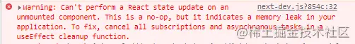
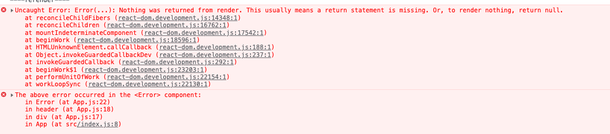

# React18

## 变更

### IE 兼容性问题

react@18 不再支持 IE11，需要兼容 IE 的请使用 react@17

### createRoot

react-dom@18 提供了 2 个根 API，一个是老的 ReactDOM.render(), 一个是新的 ReactDOM.createRoot()。

> react-dom.development.js:86 Warning: ReactDOM.render is no longer supported in React 18. Use createRoot instead. Until you switch to the new API, your app will behave as if it's running React 17. Learn more: https://reactjs.org/link/switch-to-createroot

``` jsx
// 老的写法
import React from 'react';
import ReactDOM from 'react-dom';
import App from './App';

ReactDOM.render(<App />, document.getElementById('root'));
```

``` jsx
// 新的写法
import React from 'react';
import ReactDOM from 'react-dom/client';
import App from './App';

const root = ReactDOM.createRoot(document.getElementById('root'));
root.render(
  <React.StrictMode>
    <App />
  </React.StrictMode>
);
```

### StrictMode

v16.3 就已经添加的新特性，如果作为包裹 UI 组件来用的话 `StrictMode = Fragment`，但 `StrictMode` 设计初衷并不是用来替代 `Fragment` 的，它的目的是用来检查开发模式下突出显示应用中潜在的问题。可以简单理解为 React 团队为后续版本 API 做了调整留了一个报警的口子。
比如：  
* 识别不安全的生命周期
* 使用过时 ref API
* 关于使用废弃的 findDOMNode 方法的警告

更多见： https://zh-hans.reactjs.org/docs/strict-mode.html
### setState

这个算是 React18 中最大的破坏性更新。

**React 自动批处理** 简单来说就是将多个状态的更新合并为一次重新渲染，以达到更新性能的目的。

v18 之前：只能在生命周期和合成事件函数中进行批处理，默认情况下 Promise、setTimeout以及原生事件中不会进行批处理

``` jsx
  const onClick = () => {
    Promise.resolve().then(() => {
      setCount(count++)
    })
    setFlag(!flag)
  }
  // render 会渲染 2 次
```

v18 之后：会对所有的更新进行批处理操作，上面的代码只会执行 1 次 render。  
那如果我想在 React18 中退出批处理应该怎么做呢？官方提供了一个新的 API flushSync

### flushSync

``` jsx
import { flushSync } from 'react-dom';

function handleClick() {
  flushSync(() => {
    setCount(c => c + 1);
  });
  // React 更新一次 DOM
  flushSync(() => {
    setFlag(f => !f);
  });
  // React 更新一次 DOM
}

```

React18 的自动批处理在大多数场景下对之前的代码是没有影响的，只是在 Class 组件中，如果你在两次 setState 中间去读取 state 的值的时候会出现不兼容的情况。

``` jsx
onClick = () => {
  setTimeout(() => {
    this.setState(({ count }) => ({ count: count + 1 }));
    // 在 React17 及之前，打印出来是 { count: 1, flag: false }
    // 在 React18，打印出来是 { count: 0, flag: false }
    console.log('----this.state----', this.state);

    this.setState(({ flag }) => ({ flag: !flag }));
  }, 0);
};
```
当然想要 React18 也能和之前的效果一样的话也是可以的，通过 flushSync 来解决

``` jsx
onClick = () => {
  setTimeout(() => {
    ReactDOM.flushSync(() => {
      this.setState(({ count }) => ({count: count + 1}))
    })
    // 打印 {count: 1, flag: false}
    console.log('----this.state----', this.state)
  }, 0);
}
```

### 已卸载的组件更新状态警告



原本 react 想对如下情况进行内存泄露提醒

``` jsx
useEffect(() => {
  function handleChange() {
    setState(store.getState());
  }
  store.subscribe(handleChange);
  // 未取消订阅的时候会抛出错误
  // return () => store.unsubscribe(handleChange);
}, []);
```

但是实际上应用中很少出现上面的情况，所以在 18 中移除了这个警告
### 组件返回 null

在 React18 之前, 这样写

``` jsx
const Demo = () => {
  return undefined
}
```
会抛出如下错误：



但是在 React18 中不会有这个问题了，它把这个错误提醒给删除了。

为什么要删除这个提醒呢？  
主要原因：
* React18 Suspense fallback 会出现 undefined 的情况，为了保证 fallback 为 undefined 而不报错，故删除了这个警告。
* TS 类型系统和 ESLint 已经比较健壮了，这类错误可以在写代码的时候就会有提醒，完全可以避免掉这类问题。

### 服务器渲染
## 新的 API

### useSyncExternalStore

### useInsertionEffect

### useId

### useDeferredValue


## Concurrent Mode

### useTransition

### Suspense

## v18 还未正式发布的新特性

### Server Component

### OffScreen


参考：

* https://reactjs.org/blog/2022/03/29/react-v18.html
* https://juejin.cn/post/7087486984146878494
* https://juejin.cn/post/7078511027091931167